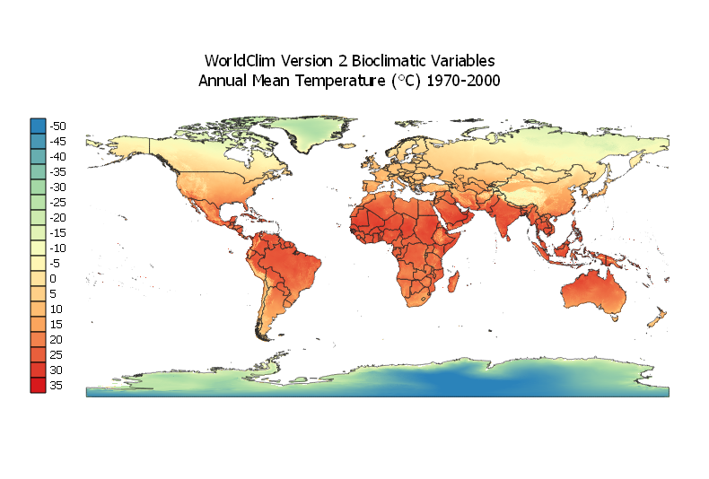
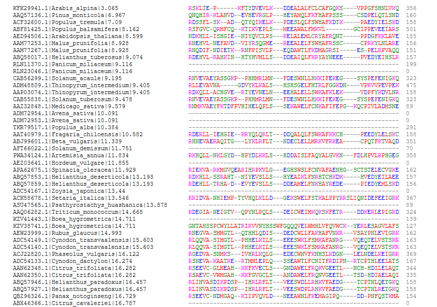

# Bioclimatic Analysis of Specificity in Leucine-Rich Repeats (BASIL)

# What is BASIL?
Bioclimatic Analysis of Specificity in Leucine-Rich Repeats (BASIL) is an Extract, Transform and Load (ETL) pipeline built to bioclimatically reference amino acid sequence data in the National Center for Biotechnology Information (NCBI) [Protein database][1]. The majority of plant disease resistance (R) genes encode proteins containing nucleotide-binding site (NBS) and leucine-rich repeat (LRR) domains ([Ellis et al., 2000][2]). The LRR domain has been shown to play a key role in pathogen specificity ([Ellis et al., 2000][2]). Observing LRR domain polymorphisms across bioclimatic gradients may allow us to predict the ability of plant species to resist infection by climate-limited pathogens.

# How Does BASIL Work?
BASIL is written in Python and uses the open source pipeline and workflow management software, Luigi. BASIL starts by searching the NCBI Protein database for amino acid sequences based on a user-defined query. A *Taxonomy ID* maps each sequence to the scientific name of a species. The scientific names are then fuzzy-matched against the Global Biodiversity Information Facility ([GBIF][3]) Checklist Bank which resolves synonyms, homonyms, varieties and subspecies to accepted species-level names. The resolved list of *Species Keys*, returned from the GBIF Checklist Bank, is then posted to the GBIF Occurrence Store in a download request. Once the requested georeferenced occurrences become available, they are downloaded and bioclimatically referenced using their geocoordinates and a global raster map of 19 bioclimatic variables.

The BASIL bioclimatic referencing engine uses the WorldClim Version 2 Bioclimatic Variables raster dataset at a spatial resolution of 2.5 minutes. This dataset, developed by Fick and Hijmans ([2017][4]), is derived from monthly temperature and rainfall values and averaged for the years 1970-2000. The bioclimatic variables are coded as follows:

Name | Description
------------ | -------------
BIO<sub>1</sub>|Annual Mean Temperature
BIO<sub>2</sub>|Mean Diurnal Range (Mean of monthly (max temp - min temp))
BIO<sub>3</sub>|Isothermality (BIO<sub>2</sub>/BIO<sub>7</sub>) (* 100)
BIO<sub>4</sub>|Temperature Seasonality (standard deviation *100)
BIO<sub>5</sub>|Max Temperature of Warmest Month
BIO<sub>6</sub>|Min Temperature of Coldest Month
BIO<sub>7</sub>|Temperature Annual Range (BIO<sub>5</sub>-BIO<sub>6</sub>)
BIO<sub>8</sub>|Mean Temperature of Wettest Quarter
BIO<sub>9</sub>|Mean Temperature of Driest Quarter
BIO<sub>10</sub>|Mean Temperature of Warmest Quarter
BIO<sub>11</sub>|Mean Temperature of Coldest Quarter
BIO<sub>12</sub>|Annual Precipitation
BIO<sub>13</sub>|Precipitation of Wettest Month
BIO<sub>14</sub>|Precipitation of Driest Month
BIO<sub>15</sub>|Precipitation Seasonality (Coefficient of Variation)
BIO<sub>16</sub>|Precipitation of Wettest Quarter
BIO<sub>17</sub>|Precipitation of Driest Quarter
BIO<sub>18</sub>|Precipitation of Warmest Quarter
BIO<sub>19</sub>|Precipitation of Coldest Quarter




Next, the bioclimatically referenced occurrences are aggregated by *Species Key* using the mean value of each bioclimatic variable and linked back to their corresponding amino acid sequences according to the following relationships:


Finally, the joined data is randomly sampled and posted back to the NCBI Protein database. Finally, a FASTA file containing protein sequences for the sampled data is downloaded and edited to include bioclimatic data in the definition line.

# BASIL in Action
In this example, we show how BASIL is used to bioclimatically reference all NBS-LRR proteins in the NCBI Protein database.

## Setting Up and Running the Pipeline
We begin by constructing the following query statement:
```sql
plants[Filter] AND nbs lrr[Title]
```
We then run the following command passing our previously constructed query statement as the `<term>` argument:
```
$ luigi --module basil-pipeline RunAllTasks --SearchDB-term <term>
```
For more information on using Luigi, please refer to the [documentation][5].

Once the pipeline is up and running, we are able to monitor the status of our tasks as well as view all dependencies in the Luigi Central Scheduler:


When the Central Scheduler shows that all tasks have completed successfully, our output data is saved in the file `data\edited-fasta.fasta` and should look something like this:

```
>KFK29941.1|Arabis_alpina|3.065
MAVTDFFAGEIAAELLKQLFLISAKAWRYKNIAERLIILIENIQPTIKEIQYSGVELPAHRQAQISMLSE
ILTNGNKLTEKVISSRRWNMFRQLTLARKMERLEKTISDFLKAPILTQILADVHLLRANSDVRFDRVDRS
LERMSEQLGSMKIGGGGLIMDAMKVAEAMMEIESSDELEKFGIGLDLGKTKVKKMMFACQGGVFGISGMG
GVGKTTLARELEKDDEVRCYFENRILFLTVSQSPILDELRARVWSFLSGCEGVNPVPSWNLKYEGGVKMQ
KLVILDDVWTREALDRLTYNIPGCTTLVVSRSKLTEPKFTYDVEVLKDDEALALFCLCAFGQKSVPPGFS
HNLVKQVAGECKGLPLALKVTGASLKDRPEKYWEGALQRLSKGEPADETHETRLLHQMKASLENLDPITR
ECFLDLGAFPEDKKIPVDVLINMWIEIHDLEEANAFATLVDLSHRNLLTLGKDPRLGASYASYYDVFVTQ
HDVLRDLALHLCNQGKVTRRERLVMPKRELVLPREWGRNSDEPFKAQIVSIHTGEMDEMDWSDFDLEFPK
AEILILNFSSDKYVLPPFISKMSRLRVLVIINNGMSHAVLHDFSIFANLSKLKSLWLERVHVPELSKTTV
PLKNLHKMSLILCKINNSFDQTGVDLSNIFPNLNDLTIDHCDDLVTLPSSICGMTSLNSLSITNCPRLGA
LPKNLSKLQALELLRLYACPELKALPLEICELPRLKYLDISQCGNLNCLPEEIGKLKMLEKIDMRECYIL
RRPSSAVSLESLRHVLCDKDVAFIWEEVEKAVPGLKIEALEKCFSLDWLDE
…
```

## Analysis
Our query of the Protein database yielded 5,661 NBS-LRR proteins sequenced from 176 plant species. This indicates that 97% of the proteins represented either multiple sequences of the same species, sequences of synonymous species, sequences of varieties and subspecies, or sequences of species that did not occur within the bounds of the raster dataset.



[1]: https://www.ncbi.nlm.nih.gov/protein
[2]: https://doi.org/10.1016/S1369-5266(00)00080-7
[3]: https://www.gbif.org
[4]: http://worldclim.org/version2
[5]: https://luigi.readthedocs.io/en/stable


